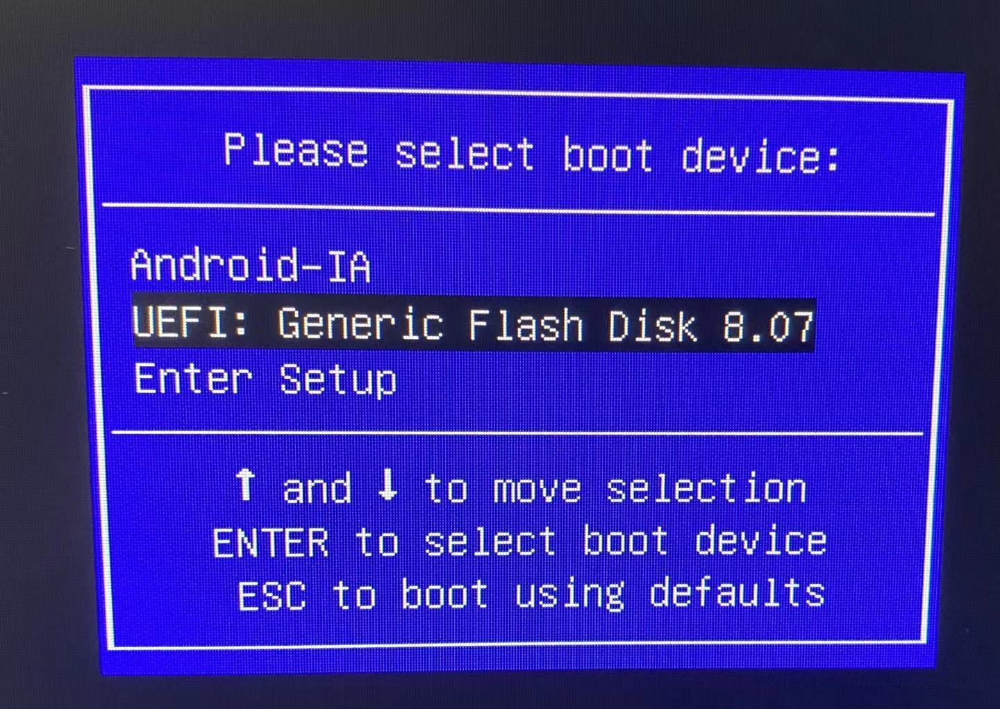
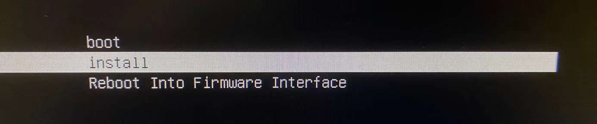
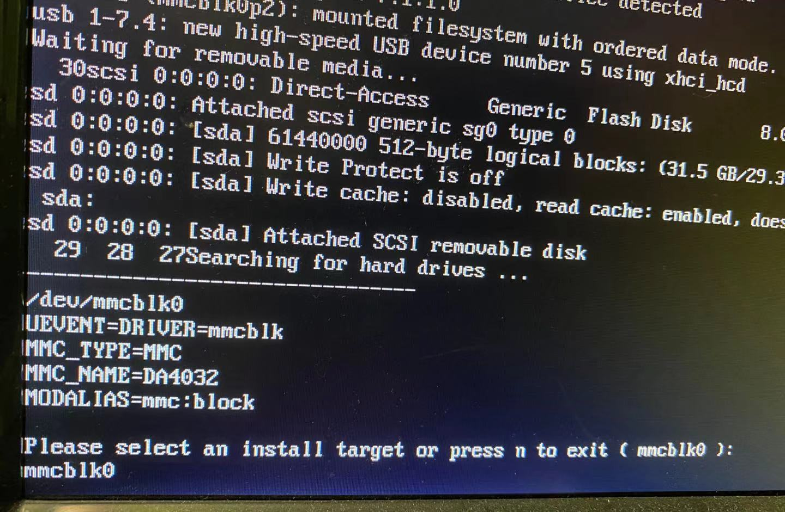
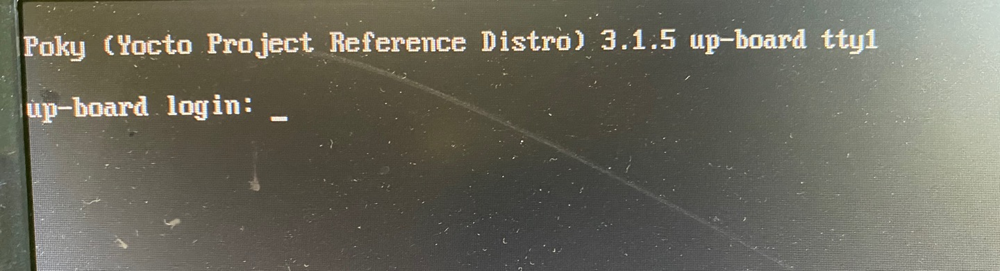

### Yocto for Up Board

revised by dj-zhou

* Tested on: Ubuntu 20.04.1 LTS
* Up Board layer: https://github.com/dj-zhou/meta-up-board
* Tested (testing) image: `upboard-image-base`, `upboard-robotics-image`

#### Build an Image

You can install Yocto build system dependencies by (command from [`djtools`](https://github.com/dj-zhou/djtools)):

```bash
yocto setup dev-env
```

To get the BSP, you need to install the  `repo` utility by (command from [`djtools`](https://github.com/dj-zhou/djtools)):

```bash
dj setup google-repo
```

Then, you can do the following (the `master` branch of `yocto-up-board` uses `dunfell` branches of the meta layers):

```bash
cd ~
mkdir yocto-up-board
cd yocto-up-board
repo init -u https://github.com/dj-zhou/yocto-up-board -b master
repo sync -j4
```

Start to build a simple image `upboard-image-base`:

```bash
cd ~/yocto-up-board
source poky/oe-init-build-env up-board
```

Before `bitbake` the image, we need to use the sample config fies from `meta-up-board`:

```bash
cp ../meta-up-board/conf/local.conf.sample conf/local.conf
cp ../meta-up-board/conf/bblayers.conf.sample conf/bblayers.conf
```

In `conf/local.conf` file, make sure the paths for `DL_DIR` and `SSTATE_DIR`  are available.

then, we can build the image by:

```bash
bitbake upboard-image-base
```

The procedure takes about 2 hours to finish, and will use up to 80GB of hard drive space.

at last, there is an image file located in `~/yocto-up-board/up-board/tmp/deploy/image/up-board/`, named as `upboard-image-base-up-board-20210123023531.hddimg`, as well as other generated files.

#### Populate Plain SDK

```bash
cd ~/yocto-up-board
source poky/oe-init-build-env up-board
bitbake -c populate_sdk upboard-image-base
```

This procedure will take more than 1 hour to finish, and will use lot of hard drive space.

#### Setup SDK to Host Computer

For this job, we can use the `yocto` command from `djtools`:

```bash
mamba@asus-rog: up-board $ yocto setup plain-sdk upboard-image-base 
    image name: upboard-image-base
       machine: up-board
        distro: poky
distro version: 3.1.5
 sdk directory: /home/mamba/.upboard-image-base-oesdk/up-board/poky-3.1.5
sudo rm "/home/mamba/.upboard-image-base-oesdk" -r

[sudo] password for mamba: 
Poky (Yocto Project Reference Distro) SDK installer version 3.1.5
=================================================================
You are about to install the SDK to "/home/mamba/.upboard-image-base-oesdk/up-board/poky-3.1.5". Proceed [Y/n]? 
```

Enter `y` here then it will finish the job.

### Using the SDK

Though the up-board is of x86-64 architecture, which means our laptop can compile the project natively and scp the executables to the up board to run. However, we can still use the standard Yocto method to cross compile a project and scp the executables to the up board to run.

TODO

### Install Image to eMMC

To install the above generated **bootable** image to the eMMC storage of the Up Board, please follow the instructions:

#### Flash the Image to a USB Drive

The `dd` command is used to flash the image to a USB drive on a **host** laptop computer on which the image was built:

```bash
sudo dd bs=4M if=tmp/deploy/images/up-board/upboard-robotics-image-up-board-20210122050841.hddimg  of=/dev/sdb status=progress
```

Or, we can run the `djtools` command as:

```bash
yocto flash /dev/sdb upboard-robotics-image
```

where `/dev/sdb` is the USB drive, and it can be found by `lsblk` command. Here is the result:

```bash
368+1 records in
368+1 records out
1545244672 bytes (1.5 GB, 1.4 GiB) copied, 210.289 s, 7.3 MB/s
```

#### Boot the Up Board

Now, we can use the flashed USB drive to boot the Up Board.

Plug the USB drive to the Up Board, connect a keyboard, and a HDMI monitor,  then power it on, and press on **F7** key to enter the boot device selection page:



Here we choose the item of the USB drive and press **Enter** key, we will see:



We choose **install**, and press **Enter** key. If you do not see the **install** choice, you may need to plug the USB drive to another USB port to try it again.

Now, the screen is scrolling, and finally we see:



So we enter **mmcblk0**, which is the eMMC of the Up Board. 

The installation will be done soon.

Finally, unplug the USB drive and press **Enter**, it will reboot the Up Board.



Because of our configuration, we should only login with **root** account, with **no** password.

### Verify GPIO, UART, I2C and SPI

TODO

